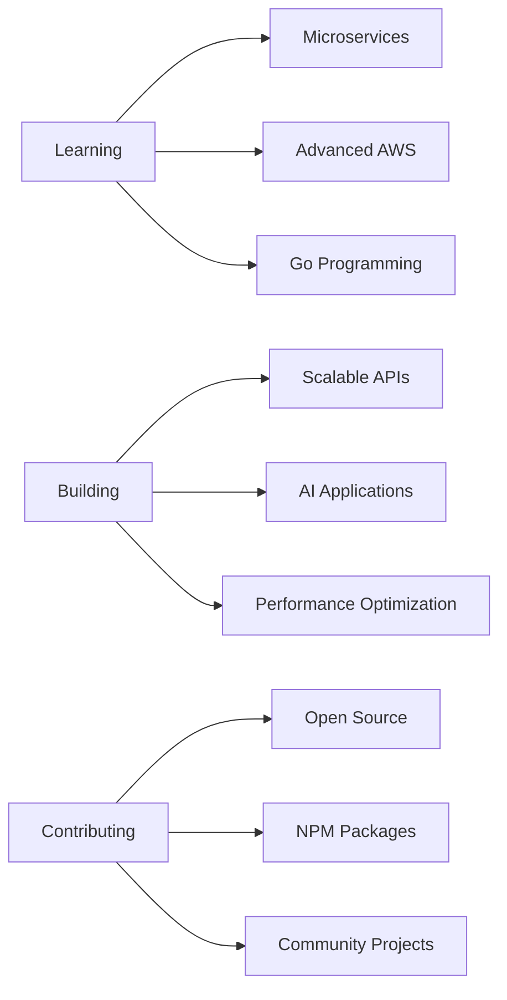

# Hey there!  I'm Sachinandan Yadav

<div align="center">
  


</div>

<div align="center">
  
  
  <a href="mailto:sachinandan.priv05@gmail.com">
    
  </a>
  <a href="https://linkedin.com/in/sachinandan">
    
  </a>
</div>

---

## About Me

```javascript
const Sachinandan = {
    location: "New Delhi, India 🇮🇳",
    education: "Computer Science Engineering @ IIIT Bhopal",
    currentFocus: "Building scalable backend systems & AI-powered applications",
    
   
    achievement: "Top 4% on CodeChef 🏆",
    
    currentlyLearning: ["Microservices Architecture", "Advanced AWS", "Go"],
    
    
};
```

---

## Tech Arsenal

### **Languages & Frameworks**
<div align="center">


</div>

### **Backend & Databases**
<div align="center">


</div>

### **Frontend & Cloud**
<div align="center">


</div>


## GitHub Analytics

<div align="center">
  


</div>

<div align="center">
  
[](https://git.io/streak-stats)

</div>


## Featured Projects

<div align="center">

### 🛡️ [sachii-safe-logger](https://github.com/sachii/sachii-safe-logger) | [NPM Package](https://npmjs.com/package/sachii-safe-logger)
**Secure logging utility with built-in data masking**
> `TypeScript` `Node.js` `NPM Package` `Security`

---

### 🤖 [HarmonyAI - Personal Health Assistant](https://github.com/sachii/harmonyai)
**AI-powered health assistant for mood improvement**
> `Next.js` `Node.js` `AI/ML` `Express.js`

---

### 📧 [Real-Time Campaign Management System](https://github.com/sachii/campaign-manager)
**Scalable newsletter platform with analytics**
> `Node.js` `MySQL` `AWS SES` `Redis` `React.js`

---

### 📚 [Learning Management System](https://github.com/sachii/lms-platform)
**Comprehensive LMS with advanced admin dashboard**
> `Next.js` `Node.js` `Authentication` `Analytics`

</div>

---

## 📈 Contribution Graph

<div align="center">
  
[](https://github.com/sachinandan-05)

</div>

---

## 🏆 Achievements & Stats

<div align="center">

[](https://github.com/sachinandan-05)

</div>

### 💡 Quick Stats
- 🎯 **CodeChef**: Top 4% ranking
- ⚡ **Performance**: 25% API response time improvement
- 🚀 **Reliability**: 99% uptime for production systems
- 📊 **Database**: 30% query performance optimization
- 👥 **Impact**: 10,000+ active users served

---

## 🎯 Current Focus



---

## Let's Connect!

<div align="center">
  
**Always open to discussing:**
- Full-stack development opportunities
- Backend architecture and optimization
- Open source collaborations
- Tech learning and mentorship

</div>

<div align="center">

### Reach out to me:

[](mailto:sachinandan.priv05@gmail.com)
[](https://linkedin.com/in/sachinandan)
[](https://github.com/sachinandan-05)

</div>

---

<div align="center">
  
### ⭐ From [Sachinandan](https://github.com/sachinandan-05) - *"Code, Debug, Optimize, Repeat!"* 🔄

</div>

---

<div align="center">
  
**💻 Weekly Development Breakdown**

<!--START_SECTION:waka-->
<!--END_SECTION:waka-->

</div>
